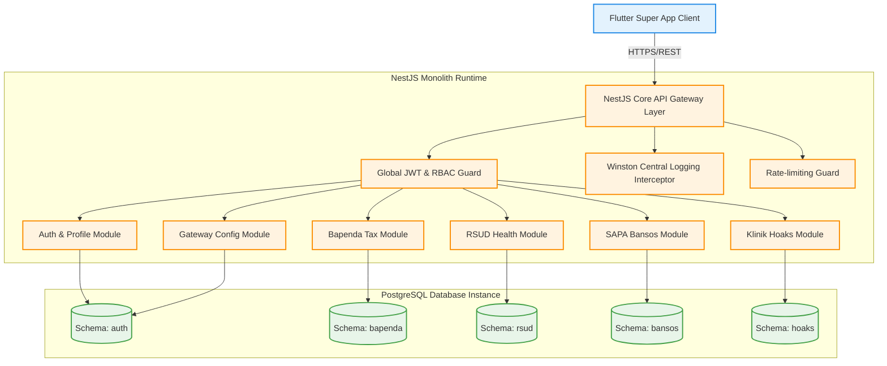

# Majadigi Super App: Modular Monolith Backend
---

This repository contains the backend system for the transformation of **Majadigi** from a conventional monolithic application into a high-performance **Super App**. It is designed using a **Modular Monolith** architecture with **PostgreSQL Schema Isolation** to eliminate resource overhead on low-end citizen devices while simplifying deployment pipelines for local government institutions.

---

## System Architecture

This system combines the ease of a *single-process* deployment with logical database separation using isolated PostgreSQL schemas for each Regional Government Department (OPD) module:



---

## Getting Started

### System Prerequisites
* Docker & Docker Compose
* Node.js v20+ (if running locally without Docker)

### Running with Docker (Recommended)
Run this single command to spin up the PostgreSQL database (complete with automatic schema initialization and demo data seeding) along with the NestJS backend API server:

```bash
docker compose up --build
```
The API server will be active and listening at `http://localhost:3000`.

### Running Locally
1. **Install Dependencies**:
   ```bash
   npm install
   ```
2. **Compile & Build**:
   ```bash
   npm run build
   ```
3. **Run Unit & Contract Tests**:
   ```bash
   npm run test          # Jest Unit Tests
   npm run test:contract # Node Contract Sanity Checks
   ```
4. **Start Dev Server**:
   ```bash
   npm run start:dev
   ```

---

## Integration Guide

This section is designed to help the Flutter team seamlessly connect their frontend screens with the backend REST endpoints.

### 1. Base Configurations
* **Base URL**: `http://localhost:3000` (or your private development server IP).
* **Format Request/Response**: `application/json`.
* **API Contract Documentation**: The comprehensive API contract and payload examples are stored in the [openapi.document.ts](file:///home/rendra/project/joki/majadigi-be/src/docs/openapi.document.ts) file. You can access the interactive Swagger UI at `/docs` when the server is running.

---

### 2. Dynamic Feature Loading Strategy
To avoid hardcoding feature menus in the Flutter client, the frontend **must** request the following configuration endpoint at application startup:

* **Endpoint**: `GET /gateway/features`
* **How it Works**: The backend returns the list of enabled modules, Flutter navigation routes, minimum required roles, and icon URLs.
* **Example Response**:
```json
{
  "active_features": [
    {
      "key": "bapenda",
      "name": "Bapenda Jatim (PKB & NJKB)",
      "active": true,
      "route": "/bapenda",
      "requires_auth": true,
      "icon_url": "https://cdn.majadigi.go.id/icons/bapenda.png",
      "version": "1.0.0"
    },
    {
      "key": "sapa_bansos",
      "name": "SAPA Bansos",
      "active": false,
      "route": "/bansos",
      "requires_auth": true,
      "icon_url": "https://cdn.majadigi.go.id/icons/bansos.png",
      "version": "1.0.0"
    }
  ]
}
```

---

### 3. Authentication & JWT Header Protection
Almost all endpoints are protected by guards. The Flutter client must attach the JWT token in every HTTP request.

* **Authentication Flow**:
  1. The user logs in via the login screen -> Send `POST /auth/login`.
  2. Securely store the returned `access_token` string in the device storage (e.g., using `flutter_secure_storage`).
  3. For all subsequent requests, append this token to the HTTP header as follows:
     ```http
     Authorization: Bearer <access_token>
     ```

---

### 4. Cheat Sheet Demo Data
Input the following mock data in your Flutter forms to trigger high-fidelity, relatiionally connected responses instantly:

| Feature / Screen | Valid Testing Input | Expected Contract Behavior |
| :--- | :--- | :--- |
| **User Login** | Email: `demo@majadigi.go.id`<br>Password: `password` | Core demo citizen account. NIK is fully linked to all Bapenda, RSUD, and SAPA Bansos history. |
| **Forgot Password** | Email: `demo@majadigi.go.id` | Triggers a simulated OTP code. Use verification code `123456` in your UI form. |
| **Bapenda PKB Tax** | License Plate: `N1234AB` | Returns active unpaid vehicle tax bills and mock payment Virtual Account generation. |
| **Bapenda PKB Tax (2)** | License Plate: `L54SA` | Luxury car (Mazda CX-3) with unpaid tax bills and accumulated penalty charges. |
| **RSUD Hospital Portal**| Hospital ID: `rsud_daha` | Displays live available beds (VIP/ICU), active surgery schedules, and submits outpatient queues. |
| **TBC Screening** | NIK: `3573010101010001` | Retrieves the TBC risk assessment history (Low/Medium/High) of the demo citizen. |
| **Point Jatim Investment**| Sector: `Peternakan` | Returns active investment projects (e.g., Pujon Dairy Farm) complete with IRR and NPV indicators. |

---

### 5. Screen Navigation-to-Endpoint Mapping

| Flutter Screen (Route) | HTTP Method | Backend API Endpoint | Primary UI Action |
| :--- | :--- | :--- | :--- |
| `/login` | `POST` | `/auth/login` | Log in and retrieve the user JWT token. |
| `/profile` | `GET` | `/profile/me` | Fetch demographics and favorite service keys. |
| `/profile/edit` | `PATCH` | `/profile/me` | Update phone numbers and home addresses. |
| `/bapenda/pkb` | `GET` | `/bapenda/pkb/check?nopol=N1234AB` | Display vehicle tax bills and specifications. |
| `/bapenda/pay` | `POST` | `/bapenda/pkb/pay` | Generate a payment VA/QRIS transaction. |
| `/rsud/detail` | `GET` | `/rsud/:hospitalId/rooms` | Fetch live room capacity counts. |
| `/rsud/queue` | `POST` | `/rsud/:hospitalId/queue` | Book an outpatient doctor schedule queue. |
| `/bansos/apply`| `POST` | `/bansos/apply` | Submit a SAPA Bansos assistance form. |
| `/hoaks/feed` | `GET` | `/hoaks/articles` | Fetch digital literacy and debunked hoax articles. |
| `/emergency` | `GET` | `/emergency/contacts` | Display rapid quick-dial emergency hotlines (112, etc.). |
| `/booking` | `POST` | `/islamic-center/bookings`| Request facility/room bookings for Islamic Center Jatim. |
